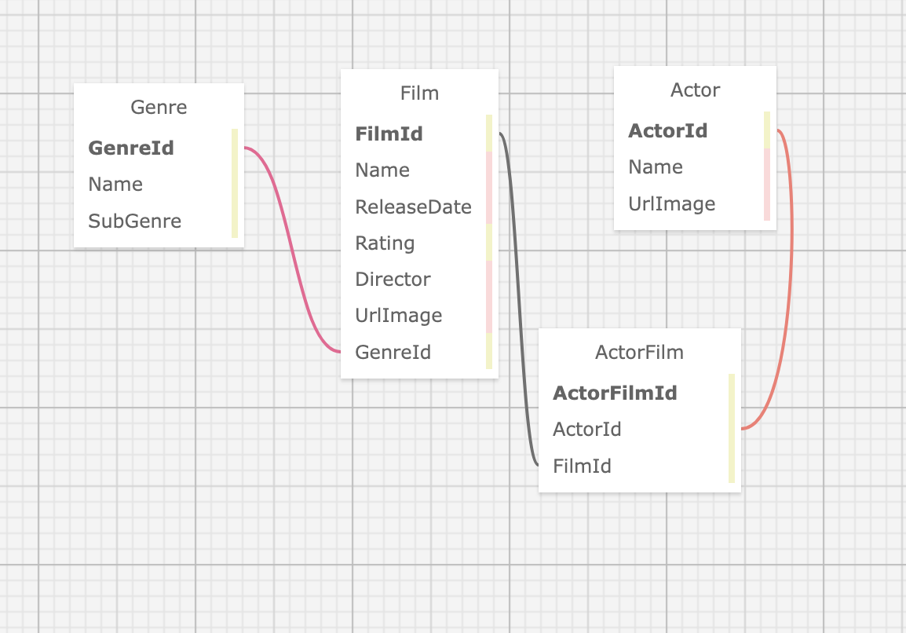

## Moofi

#### by Noah Kise, Ravin Fisher & Kim Robinson

### A C# ASP.NET Mvc Application with EFCore and MySQL

#### This app will allow a user to:
- Create, Read, Update Delete an Actor
- Create, Read, Update, Delete a Film
- Attach a movie to an actor
- Attach an actor to a movie
- Delete the relationship of movie/actor
- Search for actor by name
- Search for film by name

## Stretch Goals
* Add model validation
* Create Genre Entity with relationship to Film
* Create TVShow Entity with relationship to Actor (and Genre?) Have streaming service as a property of TVShow
* Checkbox if watched movie "Mark as seen"
* CSS Styling - cards for detail pages?

## Known Bugs
- in Edit Film, the 24 hr clock is displayed.